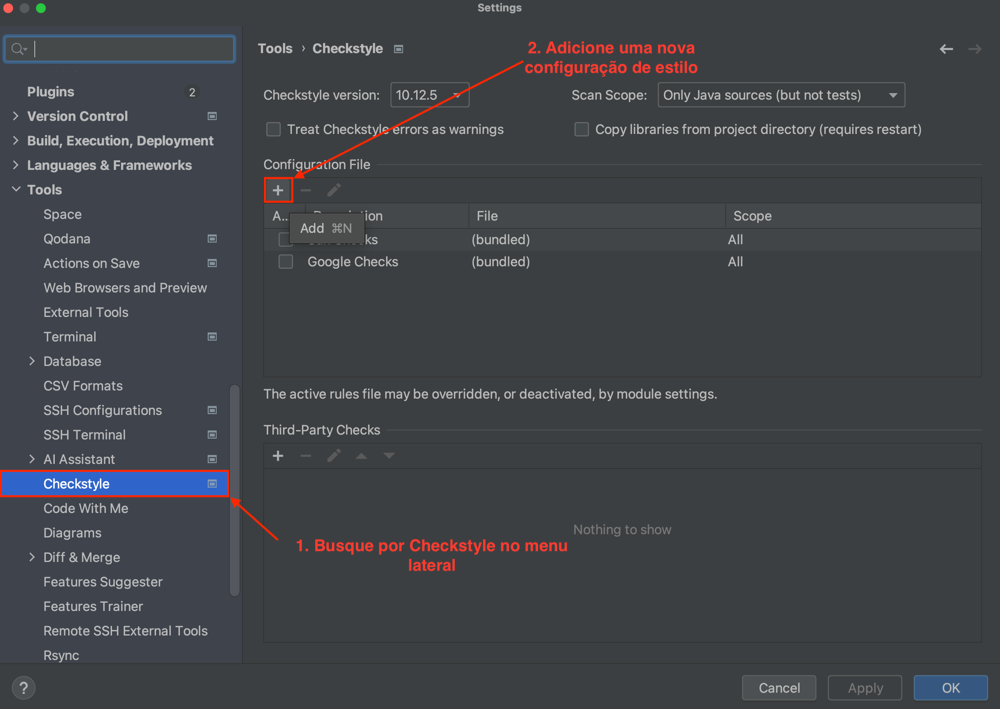
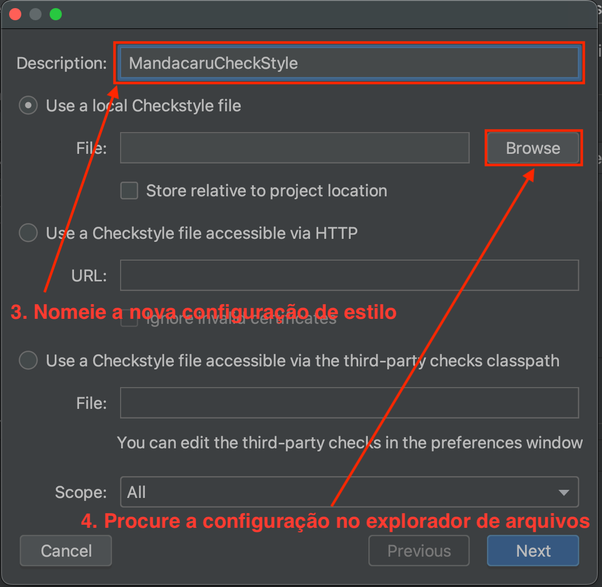
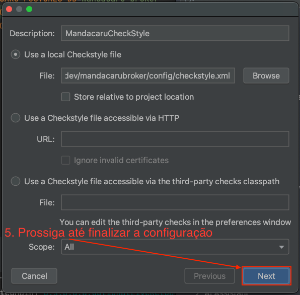
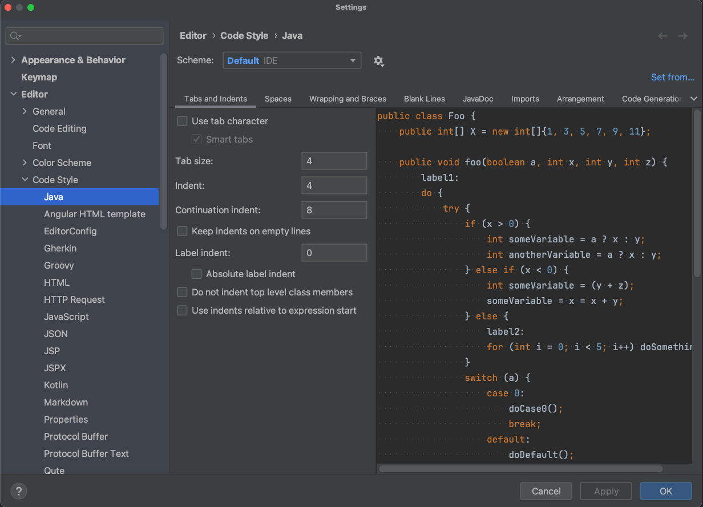

# Baixar e Configurar Plugin CheckStyle com IntelliJ

Abra as configurações do seu IntelliJ e siga o passo a passo das imagens.

**Importante:** Troque na configuração padrão do IntelliJ os tabs por espaços. Dessa forma, você vai conseguir codificar de forma adequada com o [`checkstyle.xml`](../../config/checkstyle.xml) fornecido.

