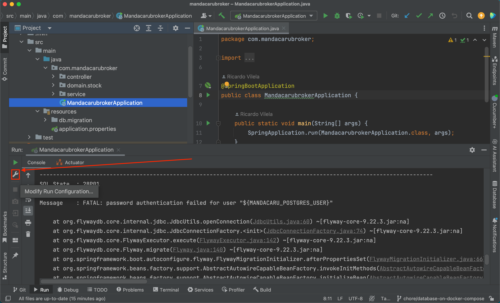
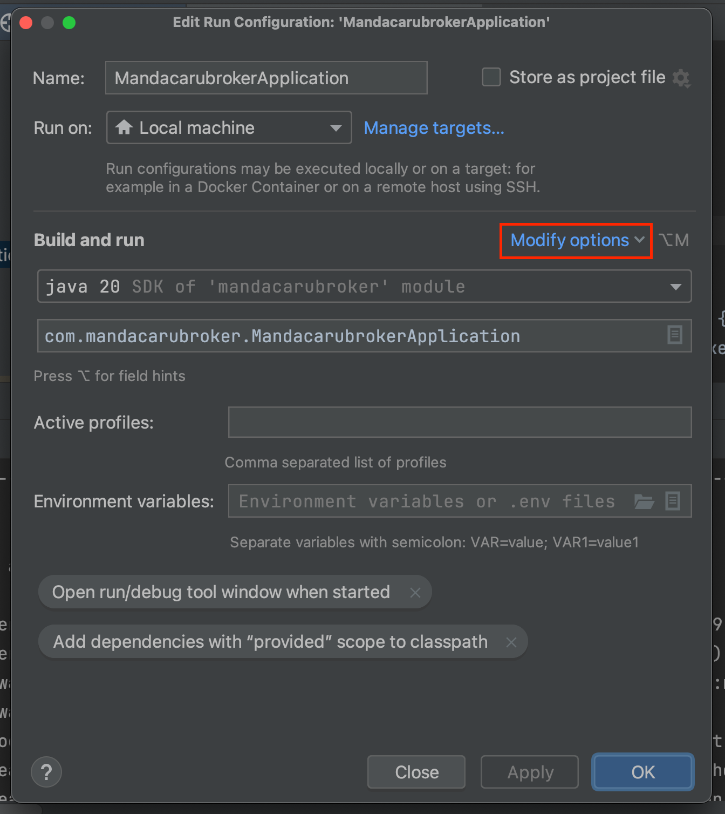
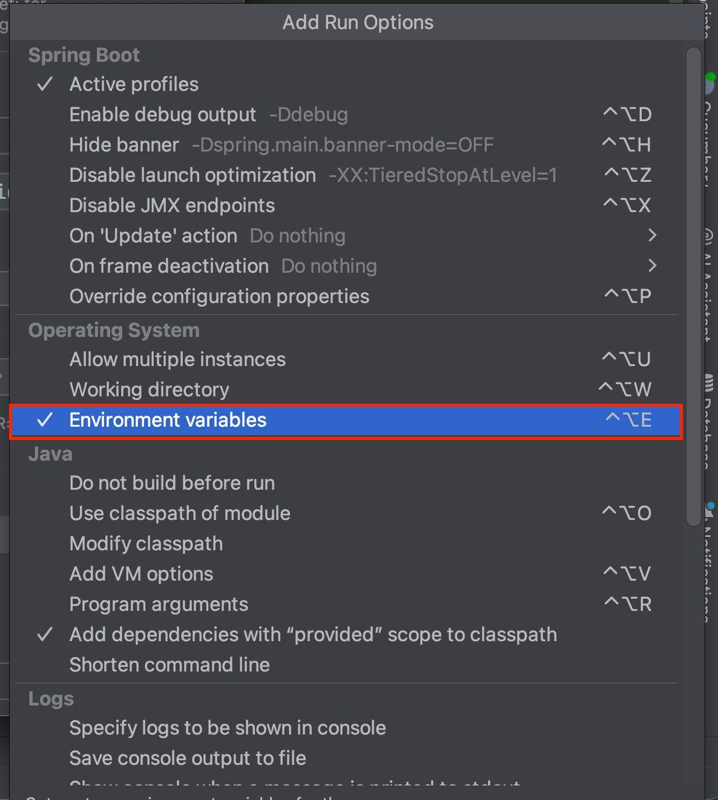
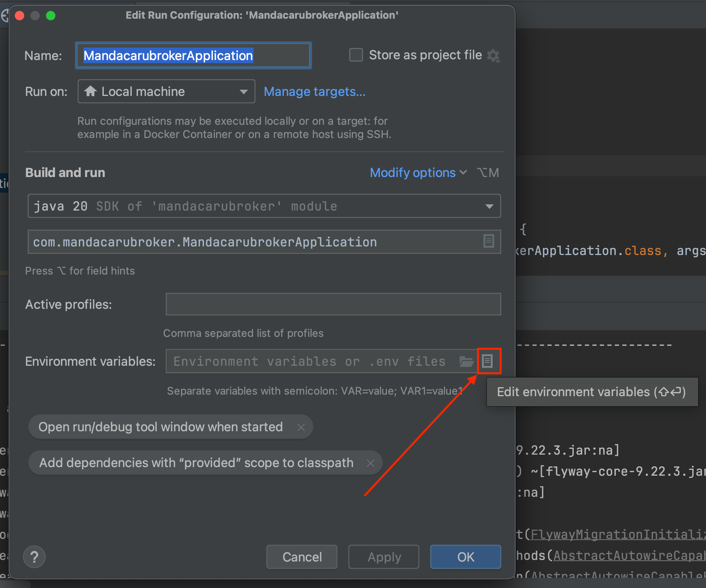
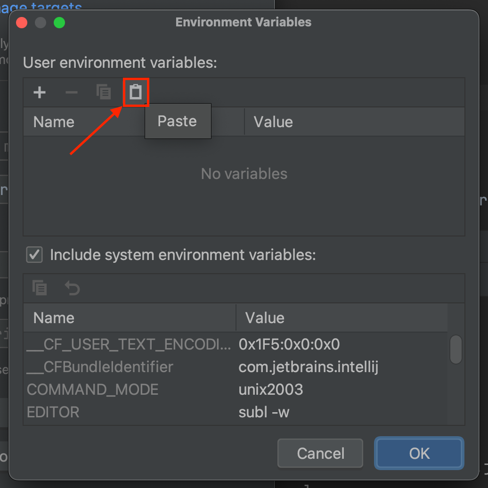
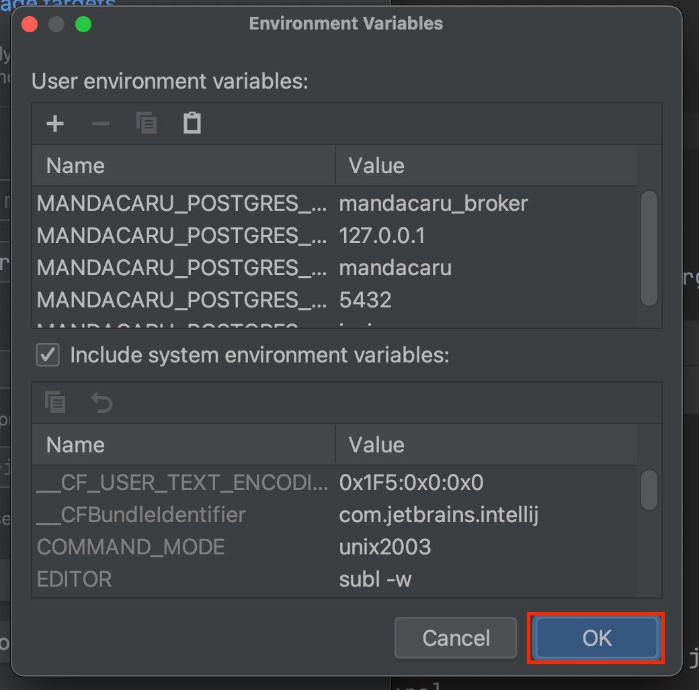

# Configurar Variáveis de Ambiente no IntelliJ

Para que o Spring consiga receber as variáveis de ambiente que estão sendo passadas para o arquivo [`application.properties`](../../src/main/resources/application.properties) é necessário setar as variáveis de ambiente que vão ser utilizadas na IDE.

Vá até o seu arquivo `.env` e copie todo o seu conteúdo. Então, prossiga com o passo da imagem a baixo para colar essas variáveis de ambiente.

Clique em `OK` para salvar.

**Importante:** Todas as vezes que for necessário mudar valores de variáveis de ambiente é necessário alterar esses valores no arquivo `.env` e na interface da IDE.
