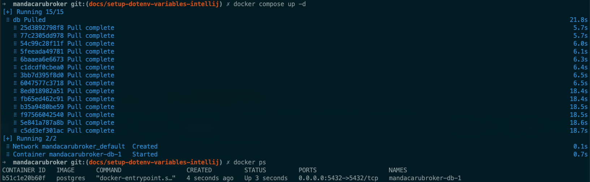

# Subir PostgreSQL com Docker Compose

Na raíz do projeto, utilize o arquivo `.env.example` como base para criar seu arquivo `.env`. Isso pode ser feito também acessando a raíz do projeto por meio da linha de comando e digitando o comando a baixo.

```sh
cp .env.example .env
```

Com as variáveis de ambiente criadas em um arquivo `.env`, rode um dos comandos a baixo. Qual comando rodar pode depender da sua máquina, mas basta testar os dois.

```sh
docker compose up -d
```

ou

```sh
docker-compose up -d
```

Após terminar de rodar o comando para subir o contêiner, execute `docker ps` para verificar que o contêiner está rodando, como na imagem a baixo.


